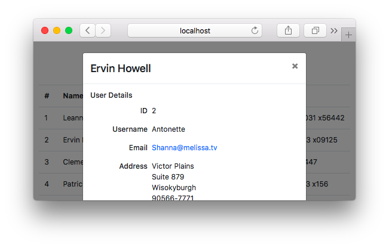

# User Viewer



This is Wyatt Fry's coding challenge submission to build a UI from data retrieved from [here](https://jsonplaceholder.typicode.com/users) and make a webpage using a modern JS Framework (this one uses Vue), that displays the data.

## Project setup
```
npm install
```

### Compiles and hot-reloads for development
```
npm run serve
```

### Compiles and minifies for production
```
npm run build
```

### Lints and fixes files
```
npm run lint
```
